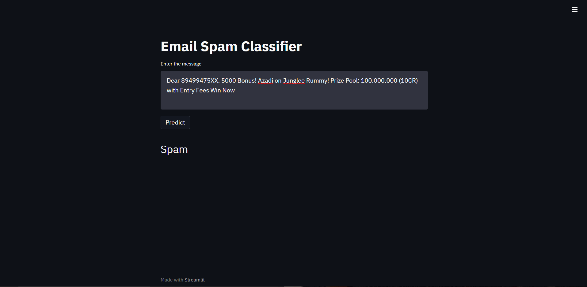

<h1>Email/SMS-Spam-Classifier</h1>

## Table of Content
  * [Demo](#demo)
  * [Overview](#overview)
  * [Motivation](#motivation)
  * [Algorithms Used](#Algorithms Used)
## Demo
Link : <a href="https://email-spam-classi.herokuapp.com/">Click Here</a> 

## Overview
This is a Streamlit web app which predicts whether a E-mail/SMS is spam or not.

## Motivation
What to do when you are at home due to this pandemic situation? I started to learn Machine Learning model to get most out of it. I came to know mathematics behind all supervised and unsupervised models. Finally it is important to work on application (real world application) to actually make a difference.

## Technologies Used

* Streamlit
* scikit learn

## Algorithms Used
* Word2Vec
* Machine Learning algorithms like Naive Bayes,Decision Tree,XgBoost etc.
* TfidfVectorizer
